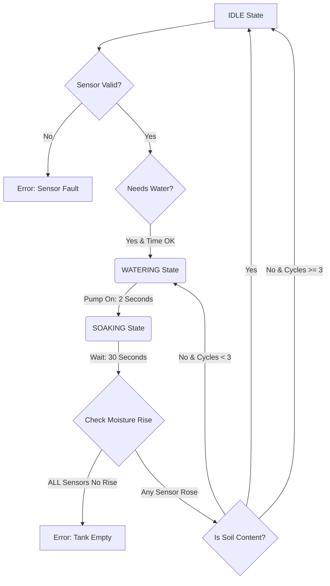
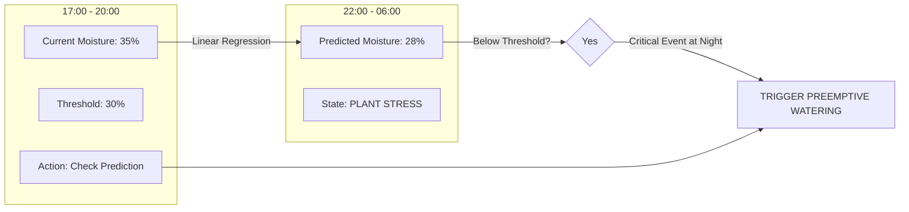

# PlantCare: Smart Watering System Design Report

## I. Introduction

### 1. Motivation

Water scarcity is one of the most pressing environmental challenges of the 21st century. Traditional irrigation and plant care methods often rely on fixed schedules or manual estimation, leading to significant inefficiencies. Over-watering not only wastes a precious resource but can also be detrimental to plant health, causing root rot and nutrient leaching. Conversely, under-watering leads to poor growth and crop failure.

The motivation behind the **PlantCare** project is to address this inefficiency through a design-centric approach to automation. By shifting from a schedule-based model to a **demand-based model**, we aim to create a system that waters plants only when strictly necessary. This "Smart Watering System" utilizes real-time soil moisture monitoring and environmental data to make intelligent decisions. The primary goal is to drastically reduce wasteful water consumption while simultaneously optimizing plant health, demonstrating how IoT technology can promote sustainable agricultural and gardening practices.

### 2. Objectives

To achieve the vision of a smart, design-led watering system, this project focuses on the following key objectives:

1.  **Design a Scalable IoT Architecture**: To construct a modular system where the backend, frontend, and firmware components are decoupled yet synchronized. This ensures that the system can support multiple sensor nodes (devices) without requiring significant architectural changes.
2.  **Implement Reliable Real-Time Communication**: To establish a low-latency data pipeline using MQTT for device-to-server communication and WebSockets for server-to-client updates. The design priority is measuring and maintaining the freshness of state (sensor readings).
3.  **Develop an Intuitive Monitoring Interface**: To create a user-friendly React-based dashboard that transforms raw sensor data (moisture %, temperature) into meaningful visualizations, allowing users to make informed decisions at a glance.
4.  **Engineer Fail-Safe Automation Logic**: To design firmware logic that handles decision-making locally on the ESP32. The system must autonomously regulate water flow based on sensor thresholds while incorporating safety guards (e.g., maximum pump runtime) to prevent hardware failure or flooding.

## II. Methodology

### 1. Plant Selection

The first step in designing the validation protocol for the PlantCare system was selecting appropriate biological test subjects. The core requirement was to choose plant species that would act as effective **biological indicators**, allowing for immediate visual verification of the system's performance. The concept of using plants as "biosensors" is well-established in precision agriculture, where physiological responses are used to trigger irrigation events [1].

We selected **Mint (*Mentha*)** and **Basil (*Ocimum basilicum*)** for this project. This decision was driven by their specific physiological attributes:

*   **Rapid Turgor Pressure Response**: Both species exhibit dramatic and immediate wilting when water-stressed. This is due to a loss of **turgor pressure**—the hydrostatic pressure within cells that pushes against the cell wall to maintain rigidity [2]. When water is scarce, this pressure drops, causing the plant to droop visually [3]. This "fainting" behavior serves as a clear, binary visual signal that allows us to cross-reference sensor data with the actual physical state of the plant.
*   **High Sensitivity**: These herbs are sensitive to soil moisture fluctuations. They do not tolerate drought well, meaning the system's responsiveness is constantly tested. If the system fails or lags, the plants will visually indicate failure within hours, not days.
*   **Fast Growth Cycle**: Their rapid growth rate allows us to observe not just immediate survival, but also the long-term health benefits of optimized watering over the short duration of the project.

By choosing these high-maintenance plants, we intentionally stressed the system designs to ensure that the automation logic could handle strict moisture requirements reliably.

### 2. Hardware Selection

The hardware architecture was chosen to prioritize modularity, reliability, and autonomy. Each component was selected to address specific engineering challenges identified in the planning phase.

#### 2.1. Microcontroller: ESP32 vs. Arduino Nano
While the Arduino Nano is a standard choice for simple automation, we selected the **ESP32** for its integrated Wi-Fi and Bluetooth capabilities. The critical requirement driving this decision was the need for **Over-The-Air (OTA) firmware updates**. In a real-world agricultural deployment, devices are often physically inaccessible (e.g., inside a greenhouse or enclosed casing). The ESP32 allows us to push code updates remotely without disassembling the enclosure, a feature not natively supported by the standard Arduino Nano [4]. Additionally, the ESP32's dual-core architecture allows us to dedicate one core to network communications and the other to sensor logic, ensuring that heavy network traffic does not interrupt the timing of pump control.

#### 2.2. Actuation: 12V Diaphragm Pump & Relay
To ensure the system could operate in various physical configurations, we selected a **12V self-priming diaphragm pump**. Unlike centrifugal pumps, diaphragm pumps can create a vacuum to draw water from below the pump level ("self-priming") and can run dry for short periods without damage [5]. This allows the water reservoir to be placed on the floor while the electronics sit on a shelf. A **12V Relay Module** acts as the interface between the low-voltage logic (3.3V from ESP32) and the high-power circuit (12V) for the pump, providing necessary galvanic isolation to protect the microcontroller.

#### 2.3. Sensing: Capacitive vs. Resistive Soil Moisture Sensors
A common point of failure in DIY irrigation systems is the corrosion of sensor probes. We explicitly chose **Capacitive Soil Moisture Sensors** over standard Resistive sensors. Resistive sensors operate by passing a DC current through the soil, which causes rapid electrolysis and corrosion of the electrodes, often failing within weeks [6]. Capacitive sensors, conversely, measure changes in dielectric permittivity and do not expose metal electrodes to the soil, significantly extending their operational lifespan and reliability.

> **Hardware Abstraction**: Initial tests revealed that affordable capacitive sensors exhibit significant manufacturing variance (up to 15% difference in ADC readings). To address this, we implemented **Per-Sensor Calibration** in the firmware. A lookup table stores specific `Air` (0%) and `Water` (100%) ADC limits for each sensor node, ensuring that "50%" means the same physical wetness for every plant regardless of hardware quirks.

#### 2.4. Power System: Portable 12V Ecosystem
To make the system a fully self-contained unit, it is powered by a **12V Rechargeable Battery**, managed by a portable battery charger. This "enclosed ecosystem" design decoupling the system from wall outlets, allowing it to be deployed in balconies or gardens where mains power is unavailable. The 12V standard unifies the power requirements for both the high-torque pump and the microcontroller (stepped down to 5V/3.3V).

## References

[1] Agriculture Victoria, "Using plants as biological indicators for irrigation automation," *ExtensionAus*, [Online]. Available: https://extensionaus.com.au/irrigatingag/using-plants-as-biological-indicators-for-irrigation-automation/.
[2] "Turgor pressure," *Encyclopaedia Britannica*.
[3] S. B. Bhattacharya, "Wilting in Plants: Causes and Recovery," *Study.com*.
[4] Espressif Systems, "ESP32 Technical Reference Manual," 2023.
[5] X. Zhang et al., "Design of automatic irrigation system based on LoRa," *IEEE*, 2017.
[6] DF Robot, "Capacitive Soil Moisture Sensor v1.2," *Product Wiki*.

## III. System Design

To achieve reliable automation, the system logic deviates from simple "if-this-then-that" rules. Instead, it employs a **Finite State Machine (FSM)** and a **Pulse-and-Soak** algorithm to mimic human gardening intuition.

### 1. Operational Logic: "Pulse and Soak" Finite State Machine
A common issue in automated systems is "overshoot," where the pump runs until the sensor detects wet soil. Because water takes time to percolate through soil, the bottom (where the sensor is) gets wet long after the top is flooded. To prevent this, our system uses a **Finite State Machine (FSM)** with a disparate control cycle.

The cycle consists of three primary states:

1.  **IDLE**: The system monitors sensors, time limits, and safety guards (e.g., max daily limit). It only transitions when all "Safe to Water" conditions are met.
2.  **WATERING (Burst)**: The pump activates for a precise duration (**2 seconds**). This minimizes runoff.
3.  **SOAKING**: The pump pauses for **30 seconds** to allow water diffusion. After this state, the system logic evaluates whether to trigger another burst or return to IDLE.

This cycle ensures that water is applied efficiently, preventing root rot and enabling the "Tank Empty" logic (checking for moisture rise during the Soak phase).

### 2. Decision Parameters: When to Water
The system does not water based on dryness alone. It evaluates multiple constraints before activating the pump:
*   **Moisture Threshold**: The primary trigger. User-configurable (default: **30%**).
*   **Time of Day (Circadian Rhythm)**: Watering is restricted to optimal biological windows: **Morning (6:00–9:00)** and **Evening (17:00–20:00)**. This prevents evaporation loss during midday heat and fungal growth from wet foliage at night.
*   **Safety Guard (Max Moisture)**: If any sensor reports >85% moisture (potential flooding or sensor fault), watering is globally disabled.

> **Note**: The system includes a **Manual Override** feature via the dashboard. This command (`PUMP_ON`) bypasses all decision parameters (Time Windows, Thresholds, and Safety Guards) to allow for maintenance or emergency watering.

### 3. Fail-Safe: Tank Empty Detection
Traditional systems rely on expensive float switches to detect empty water tanks. Our design eliminates this hardware cost by using **software inference**.
*   **Logic**: If the pump runs for a cycle (Pulse + Soak), water physics dictates that soil moisture *must* increase.
*   **Detection**: The system compares the moisture level *before* the burst vs. *after* the soak. If the average moisture fails to rise by a significant margin (**>2%**, defined as `TANK_CHECK_TOLERANCE`), it implies no water was delivered.
*   **Alert**: After 2 consecutive failures, the system assumes the tank is empty/pump has failed, locks itself in a "Safety Stop" mode, and sends a critical alert to the user dashboard.

### 4. Active Sensor Health Monitoring
To improve system resilience, we implemented an **Active Health Check** for the sensors. In typical DIY designs, a disconnected wire results in a floating value that might trigger flooding.
*   **Range Validation**: The system defines a "Valid Window" for ADC readings (100–4000).
*   **Error Flagging**: Readings outside this range (e.g., 0 for short, 4095 for open circuit) immediately flag the active sensor as `INVALID`.
*   **Response**: The system **inhibits watering** for the affected plant and explicitly reports `status: "error"` to the backend. This allows the user to identify exactly which sensor is faulty via the dashboard, rather than inferring it from wet/dry symptoms.

## IV. System Implementation

While the ESP32 handles the immediate physical control, the intelligence of the system resides in the **Application Layer**. The software architecture is designed as a **Microservices-lite** approach, decoupling the data ingestion from the user interface.

### 1. Backend Architecture: The Dual-Protocol Gateway
The Node.js server acts as the central hub, bridging the low-level hardare protocols with the high-level web interface.
*   **Protocol Translation**:
    *   **Input**: The backend subscribes to the MQTT topic `plantcare/readings` to receive lightweight binary packets from the ESP32.
    *   **Output**: It parses this data and broadcasts it via **WebSockets (Socket.io)** to the React frontend.
    *   **Benefit**: This isolates the ESP32 from the heavy load of HTTP requests. The microcontroller "fires and forgets" its data to the MQTT broker, while the powerful Node.js server handles the fan-out to multiple users.
*   **Data Persistence**:
    *   Every incoming reading is timestamped and stored in a **PostgreSQL** database.
    *   **Schema**: The data is stored in a JSONB column within the `readings` table. This "NoSQL-in-SQL" approach allows us to add new sensors (e.g., pH, Light) to the firmware without rewriting the database schema (Migrations).

### 2. Frontend Interface: Real-Time Command & Control
The user interface is built as a **Single Page Application (SPA)** using **React.js** (Vite), selected for its component-based architecture which mirrors the modular physical system (Plant Components).
*   **Real-Time Visualization**: Instead of static tables, the dashboard uses **Recharts** to render live, streaming line graphs of soil moisture. This allows the user to visually inspect the "Pulse and Soak" efficacy (seeing the sharp rise and slow plateau in real-time).
*   **Command Center**: The UI is not just a monitor but a remote controller. It allows the user to:
    *   **Override**: Trigger `PUMP_ON` manual watering.
    *   **Configure**: Adjust the moisture threshold (e.g., slider from 30% to 40%) dynamically without re-flashing firmware.
    *   **Diagnose**: View specific "Sensor Error" flags and reset system locks.

### 3. "The Brain": AI Prediction Layer
Beyond simple automation, the system integrates a Machine Learning layer using **TensorFlow.js (Node)**.
*   **Goal**: To shift from *Reactive* (Watering when dry) to *Predictive* (Watering before stress occurs).
*   **Model**: A **Linear Regression** model is trained on historical drying curves (Moisture vs. Time).
*   **Heuristic**: By calculating the "Depletion Rate" (Slope of the drying curve), the system can estimate **"Time to Empty"** (Hours until moisture hits <30%).
*   **Application**: If the AI predicts the plant will hit the critical threshold during the night (outside the active window), it can preemptively trigger a watering event in the evening window, preventing 10 hours of overnight stress.

